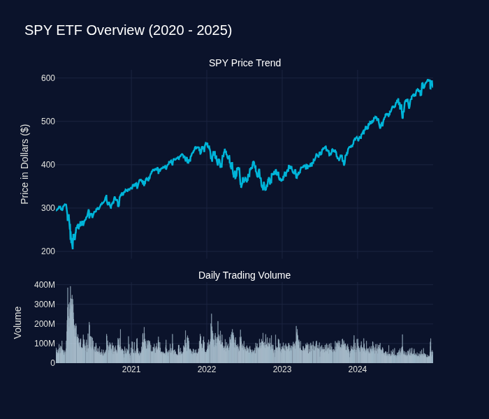
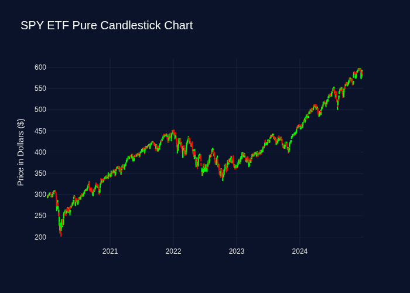

# RL Trading Agent Project

This repository contains the structure for building an end-to-end Reinforcement Learning (RL) trading agent pipeline, integrating Stable-Baselines3, FastAPI, Streamlit, MLflow, and Docker.

## Directory Structure

```text
rl_project/
├── data/
│   └── raw/             # Raw dataset files (e.g., SPY_2020_2025_daily.csv)
├── notebooks/           # Jupyter notebooks for prototyping and EDA
├── scripts/             # Python scripts for training, utility functions, etc.
└── README.md            # Project overview and execution plan
```

## Getting Started

### 1. Dataset Generation

Generate the volatile 5-year S&P 500 (SPY) daily dataset using `yfinance` and save it to `data/raw/SPY_2020_2025_daily.csv`.

Here is the data retrieval script for your reference:

```python
import yfinance as yf
import pandas as pd

# Fetch the data for the volatile 5-year period
ticker = "SPY"
data = yf.download(ticker, start="2020-01-01", end="2025-01-01")

# Clean up and save to a CSV file
data.reset_index(inplace=True)
data.to_csv("data/raw/SPY_2020_2025_daily.csv", index=False)

print("Dataset saved to data/raw/SPY_2020_2025_daily.csv")
```

### 2. Architecture & Microservices

- **Service A: MLflow (Lab Notebook)** - Experiment tracking for Actor-Critic hyperparameters, logging returns, Sharpe ratios, and storing the trained model artifacts.
- **Service B: Training Environment (Gym)** - A custom or wrapper gym environment (e.g., `gym-anytrading` or `FinRL`) to train the Stable-Baselines3 model.
- **Service C: FastAPI Backend (Broker)** - Simple REST API hosting the trained agent model for serving buy/sell predictions.
- **Service D: Streamlit Frontend (Dashboard)** - Interactive data visualization using Plotly for displaying performance, trade signals, and historical stock trends.

## Data Visualizations

The `assets` directory contains generated visual documentation of the SPY dataset used in this project. These visualizations are designed to provide both a high-level overview and a technical understanding of the data that the RL agent learns from.

### 1. Macro-Trends and Trading Volume



- **Interpretation:** The top panel displays a continuous line charting the daily closing price of the SPY ETF, while the bottom panel uses a bar chart to represent the total number of shares traded each day.
- **Analytical Significance for RL:** While the line chart easily identifies overarching market regimes (such as the sharp 2020 crash versus extended bull runs), closing price alone is insufficient for decision-making. The volume data is critical because sudden spikes in trading volume frequently act as proxy indicators for market panic or institutional shifts. An effective Reinforcement Learning agent must learn to correlate these volume anomalies with price trends to adapt its strategy during periods of extreme market stress.

### 2. Candlestick Analysis and Volatility



- **Interpretation:** A candlestick visually summarizes the entire trading day. The solid "body" indicates the difference between the opening and closing prices (green for price increases, red for decreases). The thin lines, or "wicks," extend to show the absolute highest and lowest prices reached during that session.
- **Analytical Significance for RL:** A simple line chart hides the underlying chaos of the trading day. Candlestick wicks reveal "price rejection"—moments where the market pushed the price to an extreme before snapping back. By exposing the agent to features derived from these highs and lows (such as daily price spread), the model learns to quantify intraday volatility and momentum. This allows the agent to gauge market uncertainty and avoid taking excessive risks in highly volatile conditions, rather than blindly following a long-term trend.
