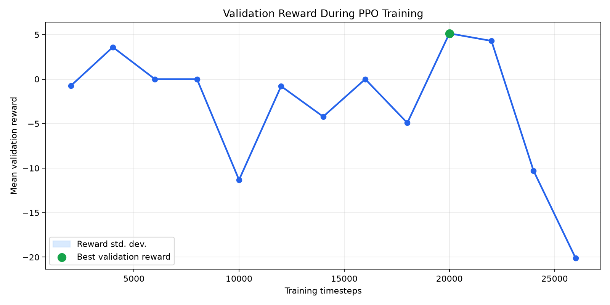

# SpyGlass-RL

SpyGlass-RL is a reinforcement learning mini project for learning how PPO behaves in a financial trading task. The project trains a policy on daily SPY ETF data and evaluates whether the agent should enter SPY or stay in cash during an unseen test period.

The expected output is a trained PPO model, MLflow experiment logs, evaluation metrics, and a Streamlit dashboard showing the model's test-time buy/sell decisions over a user-selected date range.

## Dataset

The dataset is daily OHLCV data for SPY from January 2020 through December 2024, stored locally at `data/raw/SPY_2020_2025_daily.csv`.

SPY is the SPDR S&P 500 ETF Trust, a liquid ETF that tracks the S&P 500. It fits this task because the 2020-2024 period includes multiple market regimes: the COVID crash, recovery, 2022 inflation drawdown, and the 2023-2024 rally.

Original data can be downloaded with `yfinance`:

```python
import yfinance as yf

data = yf.download("SPY", start="2020-01-01", end="2025-01-01")
data.reset_index(inplace=True)
data.to_csv("data/raw/SPY_2020_2025_daily.csv", index=False)
```

The current repository already includes the CSV, so downloading is not required for normal training.

## Setup

Python version:

```bash
python --version
```

This project was developed with Python 3.11.

Install dependencies:

```bash
python -m venv .venv
source .venv/bin/activate
pip install -r requirements.txt
```

## Suggested Commands

```bash
# Install dependencies
pip install -r requirements.txt

# Train the PPO model and log to MLflow
python src/train.py

# Start MLflow UI
MLFLOW_ALLOW_FILE_STORE=true mlflow ui --host 0.0.0.0 --port 5000 --backend-store-uri ./mlruns

# Run Streamlit locally
streamlit run app/streamlit_app.py

# Build Docker image for the Streamlit app
docker build -t spyglass-rl:1.0 .

# Run Dockerized Streamlit app
docker run --rm -p 8501:8501 spyglass-rl:1.0
```

## Training

The main model is the PPO agent from `notebooks/notebook_ppo.ipynb` Experiment 3: stationary features plus a transaction-cost-aware reward.

Train with:

```bash
source .venv/bin/activate
python src/train.py
```

Useful overrides:

```bash
python src/train.py --total-timesteps 25000 --run-name informed-trader-main
```

Important hyperparameters are in `configs/train_config.yaml`:

- `window_size`: 15 trading days of history per decision.
- `trade_cost`: 0.001, a 0.1% cost penalty for changing position.
- `total_timesteps`: 25,000 PPO training steps.
- `eval_freq`: validation evaluation every 2,000 steps.

The script saves the trained model to:

```text
models/informed_trader/best_model.zip
```

## MLflow

Training logs parameters, metrics, model artifacts, and a test decision plot to MLflow.

Start the MLflow UI with:

```bash
source .venv/bin/activate
MLFLOW_ALLOW_FILE_STORE=true mlflow ui --host 0.0.0.0 --port 5000 --backend-store-uri ./mlruns
```

Then open:

```text
http://127.0.0.1:5000
```

Logged metrics include:

- `test_total_profit`
- `test_return_pct`
- `test_total_reward`
- `test_trade_count`
- `test_sharpe`
- `test_max_drawdown`
- `test_buy_hold_return_pct`
- `val_mean_reward`
- `val_std_reward`
- `val_mean_episode_length`

Sharpe ratio measures return relative to volatility. Drawdown measures the worst peak-to-trough decline in the strategy's equity curve.

Latest logged run:

| Item | Value |
| --- | --- |
| MLflow experiment | `spyglass-ppo` |
| Run name | `informed-trader-main` |
| Train period | 2020-02-24 to 2023-07-11 |
| Validation period | 2023-07-12 to 2024-04-05 |
| Test period | 2024-04-08 to 2024-12-31 |
| Best checkpoint chosen at | 20,000 PPO timesteps by validation reward |
| Test profit | `0.7935x` |
| Test return | `-20.7%` |
| Test reward | `+1.8` |
| Test trades | `36` |
| Test Sharpe | `2.19` |
| Test max drawdown | `-2.6%` |
| Buy-and-hold test return | `+13.9%` |

Validation reward during training:



The validation graph is logged to MLflow as the `val_mean_reward` time-series metric and also saved as an MLflow plot artifact. The best validation reward happened at 20,000 timesteps, so that checkpoint was selected as the best model.

Interpretation: the latest model did learn an active policy, but it did not beat buy-and-hold on the held-out 2024 test period. This is a useful RL lesson: validation reward selected the best checkpoint according to the environment reward, but reward is still only a proxy for the financial objective. In this run, the policy's final portfolio profit was worse than simply holding SPY through the same test period.

Add the MLflow run screenshot to:

```text
screenshots/mlflow_runs.png
```

The run also logs these artifacts:

```text
mlruns/.../artifacts/model/best_model.zip
mlruns/.../artifacts/plots/training_result.png
mlruns/.../artifacts/plots/validation_reward_curve.png
mlruns/.../artifacts/metrics/test_metrics.json
```

## Evaluation

The held-out test set is the final 15% of the chronological dataset. The model is evaluated without shuffling to avoid future leakage.

Training produces:

```text
artifacts/training_outputs/informed_trader/training_result.png
artifacts/training_outputs/informed_trader/test_metrics.json
```

The plot shows SPY close price with green buy arrows and red sell arrows. The metrics compare final profit, total reward, trade count, Sharpe ratio, drawdown, and buy-and-hold return.

Current held-out result:

- The trained PPO model ended with `0.7935x` capital, or a `-20.7%` return.
- It made `36` trades over `185` test steps.
- SPY buy-and-hold returned `+13.9%` over the same test window.
- The result suggests the current reward/feature setup is educational but not yet robust enough to be treated as a profitable strategy.

## Streamlit App

Run the dashboard locally:

```bash
source .venv/bin/activate
streamlit run app/streamlit_app.py
```

The sidebar lets the user choose a test-time date range. The app shows only the model decisions inside that selected range.

## Docker Prediction App

Build:

```bash
docker build -t spyglass-rl:1.0 .
```

Run:

```bash
docker run --rm -p 8501:8501 spyglass-rl:1.0
```

Then open:

```text
http://127.0.0.1:8501
```

Add demo screenshots to:

```text
screenshots/docker_app_running.png
screenshots/demo_output.png
```

## Course Techniques

- Reinforcement Learning with PPO
- Stable-Baselines3
- Custom Gym trading environment
- Chronological train/validation/test split
- MLflow experiment tracking
- Streamlit dashboard
- Dockerized app serving

## Limitations

This is a learning sandbox, not a production trading system. The agent trades only one asset, uses daily bars, ignores taxes and liquidity limits, and learns from a short historical window. Future improvements could include walk-forward validation, more robust transaction-cost modeling, and comparison against stronger financial baselines.

## Team Contribution
