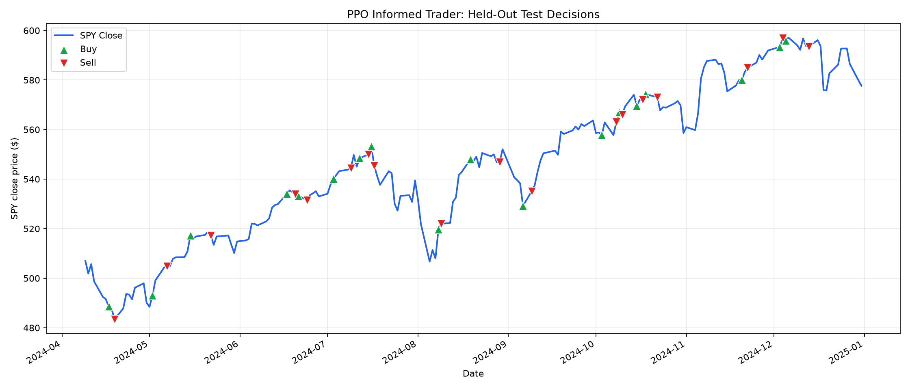
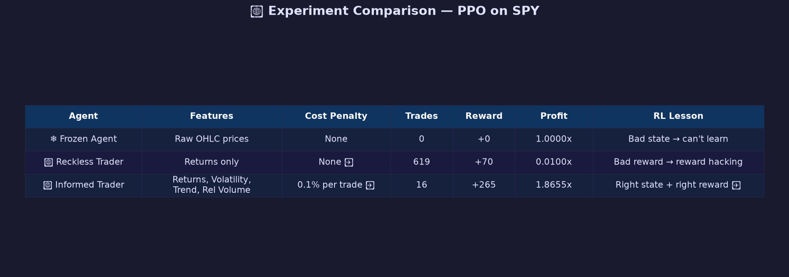

# SpyGlass-RL Final Report

## Table of Contents

1. [Introduction](#1-introduction)  
2. [Dataset and Preparation](#2-dataset-and-preparation)  
3. [Methodology](#3-methodology)  
4. [Experiments and Results](#4-experiments-and-results)  
5. [Prediction App and Docker](#5-prediction-app-and-docker)  
6. [Repository and Reproducibility](#6-repository-and-reproducibility)  
7. [Limitations and Future Work](#7-limitations-and-future-work)  
8. [Conclusion](#8-conclusion)  
9. [Appendix](#appendix)

---

## 1. Introduction

### 1.1 Brief Introduction

SpyGlass-RL is a reinforcement learning project in the finance domain. The system trains RL agents to make simple trading decisions on SPY ETF daily market data.

The final system includes model training, MLflow experiment tracking, and a Streamlit dashboard. The dashboard shows the buy and sell decisions made by the trained agent during a selected test period.

### 1.2 Problem Statement

The input is historical SPY market data, including open, high, low, close, and volume values. The output is a trading action: buy or stay in cash.

This problem matters because financial time-series data changes over time. A model that only memorizes raw price levels may fail when prices move into a new range. The project studies how reinforcement learning agents behave under this problem.

### 1.3 Objectives

- Train RL agents for SPY trading using A2C and PPO.
- Compare raw-price inputs with engineered financial features.
- Track PPO training and evaluation with MLflow.
- Build a Streamlit UI to visualize test-time trading decisions.
- Package the app with Docker for reproducible serving.

---

## 2. Dataset and Preparation

### 2.1 Dataset Description

The dataset is SPY ETF daily OHLCV data from 2020 to 2024. SPY tracks the S&P 500 index, so it is a useful proxy for the broad U.S. stock market.

- Dataset file: `data/raw/SPY_2020_2025_daily.csv`
- Number of rows: 1,258 trading days
- Data type: time-series tabular data
- Input columns: `Open`, `High`, `Low`, `Close`, `Volume`
- Output/action: buy or stay in cash


### 2.2 Data Access

The dataset is already available locally in the repository under `data/raw/`. It can also be regenerated using `yfinance` by downloading SPY data from 2020-01-01 to 2025-01-01.

For submission hygiene, large raw datasets should normally not be committed to GitHub. The current project keeps the local CSV for reproducibility during development.

### 2.3 Preprocessing

The data is sorted chronologically and missing values are forward-filled. The project uses chronological splitting:

- Training: first 70%
- Validation: next 15%
- Test: final 15%

The main PPO model uses engineered stationary features:

- `Return`: daily percentage price change
- `Dist_SMA_20`: distance from the 20-day moving average
- `Volatility_20`: 20-day rolling volatility
- `Rel_Volume`: volume compared with 20-day average volume

These features avoid feeding raw price levels directly to the policy.

---

## 3. Methodology

### 3.1 Course Techniques Used

| Technique | Where used |
| --- | --- |
| Reinforcement Learning | A2C and PPO trading agents |
| MLflow experiment tracking | `src/train.py`, `mlruns/` |
| Streamlit model UI | `app/streamlit_app.py` |
| Dockerized app serving | `Dockerfile` |
| Evaluation and result plots | `artifacts/`, `notebooks/ppo_evaluation_plots/` |

### 3.2 Model Architecture

Two RL model architectures were explored:

| Model | Purpose |
| --- | --- |
| A2C | Initial advanced agent experiment in `notebooks/notebook.ipynb` |
| PPO | Main experiment pipeline in `notebooks/notebook_ppo.ipynb` and `src/train.py` |

The main submitted model is PPO from Stable-Baselines3 with `MlpPolicy`. PPO learns a policy, which means a rule for choosing an action from the current market observation.

Important hyperparameters:

- Policy: `MlpPolicy`
- Window size: 15 trading days
- Total timesteps: 25,000
- Validation frequency: every 2,000 steps
- Trade cost penalty: 0.1%

### 3.3 Training Strategy

The model is trained on the training split and checked on the validation split. The best checkpoint is selected by validation reward.

The test split is only used after training. This avoids future leakage, which means the model should not see future data while learning.

---

## 4. Experiments and Results

### 4.1 MLflow Tracking

MLflow logs the PPO training run. It records parameters, metrics, artifacts, and the trained model.

Logged parameters include:

- model algorithm
- policy type
- learning rate
- split dates
- window size
- trade cost
- total timesteps

Logged metrics include:

- test profit
- test return
- test reward
- trade count
- Sharpe ratio
- max drawdown
- buy-and-hold return

Logged artifacts include:

- best model zip file
- training result plot
- test metrics JSON
- training config

The latest MLflow run is stored under `mlruns/`.

### 4.2 Evaluation Results

Latest PPO training result:

| Metric | Value |
| --- | --- |
| Test profit | `0.7935x` |
| Test return | `-20.7%` |
| Test reward | `+1.8` |
| Test trades | `36` |
| Test steps | `185` |
| Sharpe ratio | `2.19` |
| Max drawdown | `-2.6%` |
| Buy-and-hold return | `+13.9%` |



The PPO model learned an active trading policy, but it did not beat buy-and-hold on the test period. This is an important result. It shows that positive reward does not always mean positive financial profit.

The earlier PPO experiments also show why feature engineering and reward design matter.



---

## 5. Prediction App and Docker

### 5.1 Prediction Pipeline

The app loads the trained PPO models and local SPY data. The user selects a date range from the sidebar.

For each date in the selected range, the model sees a 15-day window of market features. It then predicts one action:

- buy or hold SPY
- sell or stay in cash

The app displays the resulting decisions as arrows on the SPY price chart.

### 5.2 Prediction UI

The UI is built with Streamlit. It shows selected-period model decisions, not the full five-year timeline.

The chart is intentionally simple. It uses a continuous SPY close-price line with buy and sell arrows.

### 5.3 Docker Serving

The repository contains a `Dockerfile` for serving the Streamlit app. Docker makes the app easier to run on another machine with the same environment.

The README contains the Docker build and run commands.

Docker screenshot path for final submission:

```text
screenshots/docker_app_running.png
```

---

## 6. Repository and Reproducibility

### 6.1 Repository Structure

Important files and folders:

```text
README.md
report.md
requirements.txt
.gitignore
Dockerfile
src/train.py
app/
configs/train_config.yaml
notebooks/
mlruns/
models/
data/
artifacts/
screenshots/
```

### 6.2 GitHub Rules

The repository should not include virtual environments, cache files, private credentials, or unnecessary generated files.

MLflow runs are kept because they provide evidence of training and experiment tracking.

### 6.3 Reproducibility

A reviewer can reproduce the project by installing dependencies, placing the dataset in `data/raw/`, running the training script, checking MLflow logs, and running the Streamlit app.

The main training configuration is stored in:

```text
configs/train_config.yaml
```

The main training script is:

```text
src/train.py
```

---

## 7. Limitations and Future Work

### 7.1 Limitations

- The project uses only one asset: SPY.
- The model uses daily data only.
- The final PPO run did not beat buy-and-hold.
- The trading setup is simplified and does not model all real market costs.

### 7.2 Future Improvements

- Test more assets and longer time periods.
- Improve reward design.
- Try stronger validation such as walk-forward testing.
- Add more robust baseline comparisons.
- Improve model selection using profit-based metrics as well as reward.

---

## 8. Conclusion

This project built a reinforcement learning trading system for SPY data. A2C and PPO were explored, with PPO used for the main reproducible training pipeline.

The project shows that raw prices can mislead RL agents in financial markets. Engineered stationary features are more useful, but reward design and validation are still difficult.

The final system includes training, MLflow tracking, a Streamlit app, and Docker support. The model did not produce a profitable final test result, but the project successfully demonstrates the full RL workflow and the main challenges of applying RL to trading.

---

## Appendix

### A. Final Submission Checklist

- Training script: `src/train.py`
- Config file: `configs/train_config.yaml`
- MLflow runs: `mlruns/`
- Streamlit app: `app/streamlit_app.py`
- Dockerfile: `Dockerfile`
- Final report: `report.md`
- Training plot: `artifacts/training_outputs/informed_trader/training_result.png`

### B. Final Notes

Team contribution section is intentionally left out of this report draft and can be added later if required.
